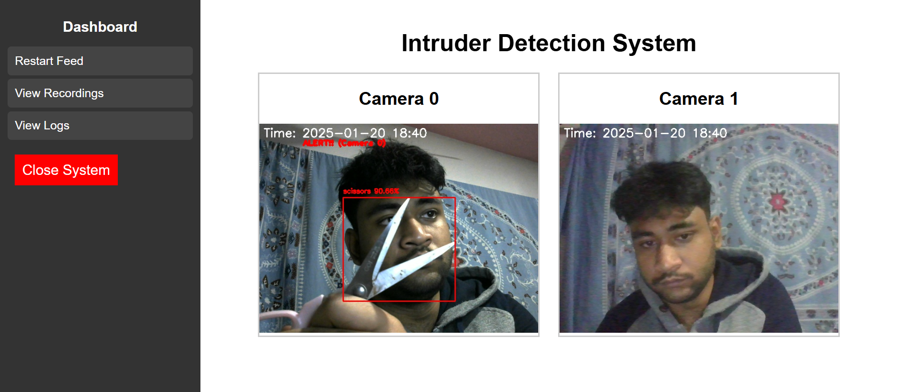
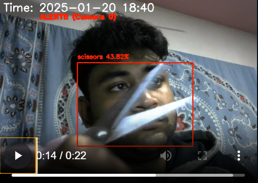

# Intruder Detection System

## Description
This project is an intruder detection system that uses YOLO (You Only Look Once) for real-time object detection. The system is capable of monitoring multiple cameras and detecting harmful objects such as guns, knives, and other dangerous items. The application streams video feeds from connected cameras and uses YOLO to detect these objects in real-time.

## Features
- Real-time video streaming from connected cameras.
- Object detection using YOLO for harmful objects like guns, knives, and more.
- Handles dynamic reconnection to cameras if they disconnect.
- Customizable harmful object classes for detection.
- Web-based interface for monitoring multiple camera feeds.
  
## Requirements
- Python 3.x
- Flask
- OpenCV
- Ultralitycs YOLO
- NumPy

## Screenshots

 

## Setup

### 1. Clone the repository
First, clone the repository to your local machine:
```bash
git clone https://github.com/yourusername/intruder-detection.git
```

### 2. Create a Virtual Environment
Navigate to the project directory and create a virtual environment:
```bash
cd intruder-detection
python -m venv venv
```

### 3. Activate the Virtual Environment
#### On Windows:
```bash
venv\Scripts\activate
```
#### On macOS/Linux:
```bash
source venv/bin/activate
```

### 4. Install Dependencies
Install the required dependencies:
```bash
pip install -r requirements.txt
```

#### Sample `requirements.txt`
```
Flask==2.0.1
opencv-python-headless==4.5.3.56
numpy==1.21.2
ultralytics==8.0.0
```

### 5. Run the Application
Run the Flask application:
```bash
python app.py
```
By default, the application will run on `http://127.0.0.1:5000/`.

### 6. Access the Camera Feeds
Open your browser and go to `http://127.0.0.1:5000/` to view the camera feeds. The system will display video streams from the available cameras, and harmful objects will be detected and highlighted.

## Structure

- `app.py`: Main Python script to run the Flask application and handle video feeds and object detection.
- `templates/index.html`: The HTML template that provides the web interface to view the video feeds.
- `static/css/styles.css`: Styling for the user interface.
- `yolo11n.pt`: Pre-trained YOLO model file for object detection.
  
## License
This project is licensed under the MIT License - see the [LICENSE](LICENSE) file for details.
